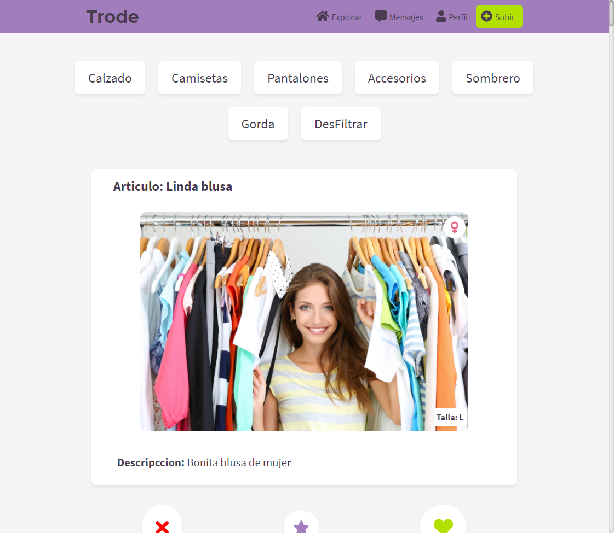

# About - At Your Click

Proyecto Personal Platzi Master - Cohort 3 - Grupo Ana Belisa

## Project description

Web app proyect for market food

## Scope

This application want to help to business to offer products and news in page hosted in Internet

Este protecyo tendra como alcance la creacion de un sistema de gestion de casos para soporte tecnico

- Buscar los items mediante un buscador
- Filtrar los items mediante el uso de categorias que te mostrara la informacion contenida en cada una de estas
- Agregar los items que desees a tu carrito de compras, donde podras agregar, restar o eliminar unidades del item a comprar
- Una vez hecho esto procederas a el proceso de compra donde en este caso se implementara ...
- En caso de no tener estar con la sesion iniciada se solicitara iniciar sesion o registrarse, luego de esto se redigira a la pagina para continuar la compra

## Creadores

- Alexander Alvarez

---

## Wireframes

- [Login](https://docs.google.com/drawings/d/1C5p-O7dgvajtuP4iEs6gqUMlV4xsQa3-owzjTcNc8S4/edit)
- [Enrolar Nuevos Usuarios](https://docs.google.com/drawings/d/15ZLCanCcz9_doBW3zIYOb6zLJs4AWDXqvgP1TbFXxPU/edit)
- [Enrrolar Servicio](https://docs.google.com/drawings/d/11ic77P5cxew2Qw3OwEaUo-4SVGkpZ-i_5LfpIQ04xZk/edit)
- [Crear Evento Usuario](https://docs.google.com/drawings/d/1IoPNlx51YLBDSTdgetv1h_oMDPS-2GVbRfY_XkcOzJ8/edit)
- [Listado Casos - Agentes](https://docs.google.com/drawings/d/1HhM1ZzabrWv3KKZjjAhaNPNixjgbwXobqCMsRtqTuTc/edit)

## Entregas

### Viernes 26 Junio

- Wireframes

### Viernes 3 Julio

- Mockups

### Viernes 10 Julio

- Diseñar base de datos para el proyecto personal y entregar documentación del diseño de la base de datos

### Viernes 17 Julio

- Desarrollo del Backend del Proyecto (CRUD) + Entregable de al menos 2 acciones

### Viernes 24 Julio

- Entrega y Despliegue del Proyecto

### Viernes 31 Julio

- Entrega FInal

---

## How to Install

For install just need…

1. Download or clone the repository
2. install in your local machine

```jsx
npm install
```

## How Run in dev mode
```jsx
npm run start
```

## Test
```jsx
npm test
```

## Definiciones para el desarrollor

### Frontend

- Componentes created has NameOfComponent.jsx en ./src/components/Component.jsx
- Style for each component created in SASS has NameOfComponent.scss in ./src/assets/styles/Style.scss
- Test will be created has NameOfComponent.test.js in ./src/__test__/Test.test.js

## Technologies

### Frontend
- React based in components
- Sass how .scss

### Backend
- Node.js for ...
- PHP for ...

## Demo

You can see the demo live, [here](https://mastereatsplatzi.github.io/Master-Eats/)

## Image Preview



Image Preview

# License

This Food Market is released under the [MIT License](https://opensource.org/licenses/MIT).

### I born at 16/06/2020